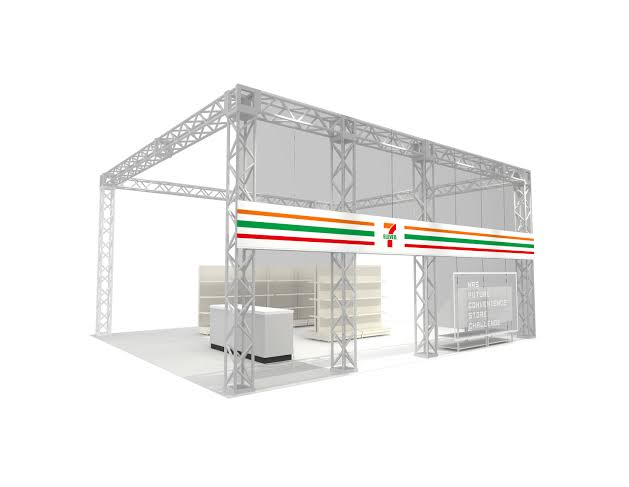

This is a Web page to provide some software resources and share development results for the FCSC (Future Convenience Store Challenge) in WRS (World Robot Summit).

## Overview of the Project

### The World Robot Summit (WRS)

The World Robot Summit (WRS) consists of two parts: World Robot
Challenge (WRC), a robot competition in which teams from all over the
world compete in 4 categories where use of robots is highly expected;
and the World Robot Expo (WRE), an exhibition that features advanced
robots and robotic technologies and provides a glimpse of robots
working in the present and in the future.

- WRS Web page: [https://worldrobotsummit.org/](https://worldrobotsummit.org/)

### Future Convenience Store Challenge (FCSC)

This is the world first challenge aiming to realize the future
convenience store, where new services are offered to customers through
robotics that can help reduce the burdens of the employees.

- FCSC Web page: [https://f-csc.org](https://f-csc.org)

## Resources

- Gazebo model: [https://github.com/FCSC/wrs_gazebo_worlds](https://github.com/FCSC/wrs_gazebo_worlds)
- Disposal Task Lottery: [https://fcsc.github.io/disposal_lottery/](https://fcsc.github.io/disposal_lottery/) 

